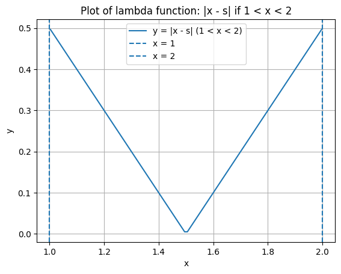
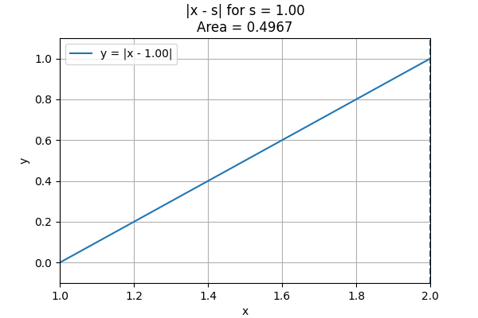
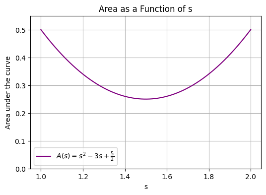

# How I solved (I think) the most recent Jane Street puzzle

Before reading this, please read the puzzle linked here https://www.janestreet.com/puzzles/current-puzzle/.

I have an undergraduate degree in math and a masters in stats, the goal of this write-up is to give an unfiltered understanding of my thought proccess when doing difficult problems.

The first think I did was calculate the loss of the of a car by saying that if we have a threshold *a*, then if a car is travelling at a speed of *S* and it meets a faster car in the same lane then the loss is:

$$\frac{S}{2}$$

if $S<a$ and 

$$\frac{(S-a)}{2}$$

if $S>a$

or in other words

$$
f(S) = 
\begin{cases}
\frac{S}{2}, & \text{if } S < a \\
\frac{S - a}{2}, & \text{if } S > a
\end{cases}
$$

*Explain the reasoning and why it's wrong*

I thought the case $a=S$ completely irrelavant because $S$ a uniform distrabution of all the real numbers between 1 and 2, so the chance of picking any one partular number is 0 and so that situation does not affect the cost.

This is obviously incorrect (as shown in the second example of the second paragraph), let this be an example to read the question more thoroughly.

I would later (while doing something completely different) find the loss function to be 

$$
f(S) = 
\begin{cases}
S^2, & \text{if } S < a \\
(S - a)^2, & \text{if } S > a
\end{cases}
$$

by basially saying if the car is travelling at a speed *S* and it has to slow down to a speed *a* (*a* can be $0$ as well for this thought experiment) then that takes 2(S-a) time and on average you're $\frac{(S-a)}{2}$ below your top speed, so you just multiple those numbers together.

The second realisation was that faster cars are only ever going to catch up to your car from behind and slower cars are only going to get caught by faster cars. However they are not all caught at the same rate. For example, if you're going at 1.5 miles/min and 2 cars travelling at 1.75 miles/min and 2 miles/min respectively, and they start their journeys $n$ and $2n$ meters behind you, then they will reach you at the same time.

This is the same in the other direction, a car travelling at 1.5 miles/min will catch up to a car travelling at 1 mile/min twice as fast as a car travelling at 1.25 miles/min.

I foramised this into to a (kinda) desity function of cars that are represented on our journey

and so this is the function 
$$
f(S) = 
\begin{cases}
|x-s|, & \text{if } 1 < x < 2 \\
0, & \text{otherwise}
\end{cases}
$$

# PDF rabbit hole

This is when I go down a bit of a rabbit hole because I basically took this as a probability density function and of course for a probability density function $f(x)$ $$\int_{-\infty}^\infty f(x)dx = 1$$ must be true, so obviously I thought.

$$\text{Expected Loss} = \int_{1}^{2}L[S|a]dS$$

where

$$
    L[S|a]= 
\begin{cases}
    \frac{a^2S}{2S^2-6S+5},& \text{if } 1 < S < a\\
    \frac{S^2-4S+4}{2S^2-6S+5},              & \text{if } a < S < 2\\
    0 & \text{otherwise}
\end{cases}
$$

find the value of a such that 

$$\frac{d\text{Expected Loss}}{da}=0$$

then I asked chatgpt to solve this.

# Getting back on track 

Then I realised, kinda after figuring out that they really don't need to be a pdf, and infact there is the property that cars travelling very fast and very slow are much more likely to be hit.

The area under the curve can be calculated as 

$$A(x) = s^2 - 3s + \frac{5}{2}$$

which is actually 

and this is fine.

# Corrected equation

$$EL(a) = \int_{1}^2L[S|a]ds$$

where

$$
    L[S|a]= 
\begin{cases}
    \frac{1}{2}(2-S)^2(S-a)^2,& \text{if } a < S\\
    \frac{1}{2}(S)^2(a-S)^2            & \text{if } S < a
\end{cases}
$$

so I split it into 

(this loss function only considers the loss of each car and not the time it takes away from other cars, I thought that this was fine because the expected loss of time over every car is the same as the expected loss that each car takes away from eachother)

$$ EL(a) = \int_a^2   \frac{1}{2}(2-S)^2(S-a)^2 ds + \int_1^a \frac{1}{2}(S)^2(a-S)^2 ds$$

then I need to find the local minima which is of course when 

$$\frac{dEL(a)}{da} = 0$$

$$\frac{d\int_a^2   \frac{1}{2}(2-S)^2(S-a)^2 ds}{da} + \frac{d\int_1^a \frac{1}{2}(S)^2(a-S)^2 ds}{da} = 0$$

then from solving the equations in the pdf rabbit hole, I could infer that we can employ the [Leibniz integral rule](https://en.wikipedia.org/wiki/Leibniz_integral_rule)
to get the equation

$$\int_{1}^{a}S^2(a-S)ds -\int_{a}^2(2-S)^2(S-a)ds = 0$$

$$\frac{a^4-4a+3}{12} = \frac{a^4-8a^3+24a^2-32a+16}{12}$$

$$8a^3-24a^2+28a-13 = 0$$

$$a \approx 1.2266988258$$